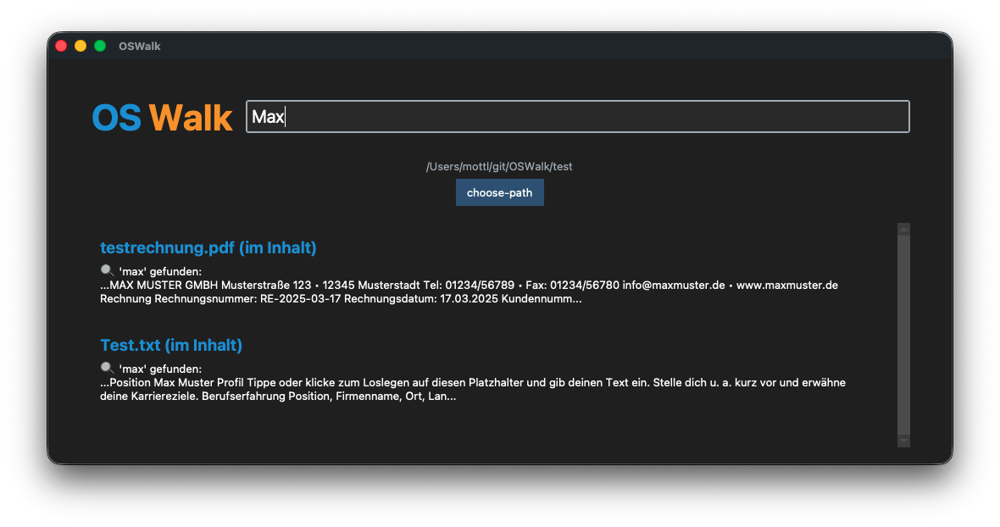

# OSWalk

Suchmaschine für den PC.
Eine Anwendung zum rekursiven Durchsuchen von Dateiinhalten in einem ausgewählten Ordner.

## Features

- **Unterstützt Linux MacOSX Windows** - Suchmaschine für einen PC die wie Web Suchmaschinen funktioniert
- **Volltextsuche** - Dateien werden eingelesen und nach bestimmten Keywords durchsucht
- **GUI-Oberfläche** - Auswahl eines Hauptordners für die rekursive Suche
- **PDF-Suche** - Speziell: Suche nach Kundennummern Namen usw. im PDF Inhalt
- **optional OCR-Integration** - Texterkennung in PNG-Bildern mit pytesseract
- **Terminal** - print() wird in Console in GUI übergeben
- **Dateiformate** - können nach Belieben eingebaut werden vorerst alles was textract unterstützt
- **Suchtreffer** - Treffer im Dateinamen werden nicht im Inhalt durchsucht. Diese werden übersprungen

## Screenshot App Main Page

